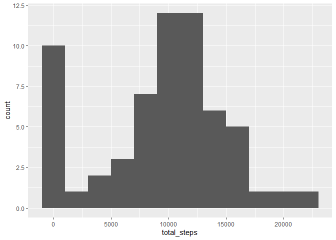
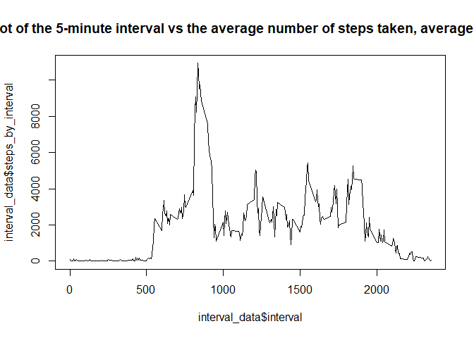
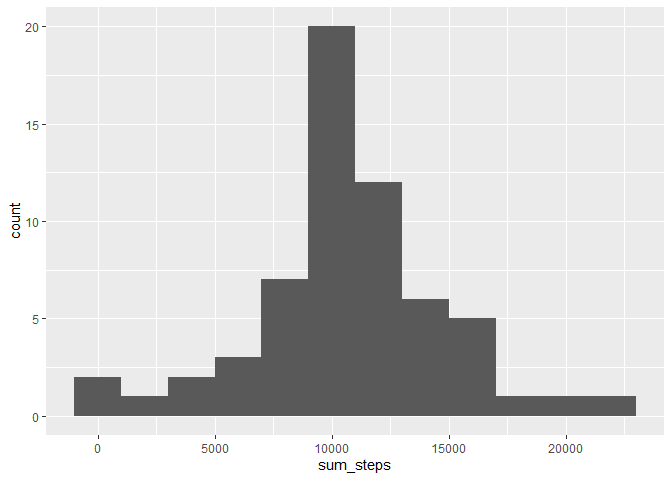

## Loading and preprocessing the data

Load lirary

```r
library(ggplot2)
library(knitr)
library(dplyr)
```

```
## 
## Attaching package: 'dplyr'
```

```
## The following objects are masked from 'package:stats':
## 
##     filter, lag
```

```
## The following objects are masked from 'package:base':
## 
##     intersect, setdiff, setequal, union
```


```r
## Load Data 
## Create data directory

if(!dir.exists("data")) { dir.create("data") }

## Download and unzip data file

file.url   <- "https://d396qusza40orc.cloudfront.net/repdata%2Fdata%2Factivity.zip"
file.path  <- "data/activity_monitoring_data.zip"
file.unzip <- "data/activity_monitoring_data.csv"

if(!file.exists(file.path) & !file.exists(file.unzip)) {
  download.file(file.url, file.path)
  unzip(file.path, exdir = "data")
}
## Load data
amd <- read.csv("./data/activity.csv")
```

Check first few rows of data


```r
head(amd)
```

```
##   steps       date interval
## 1    NA 2012-10-01        0
## 2    NA 2012-10-01        5
## 3    NA 2012-10-01       10
## 4    NA 2012-10-01       15
## 5    NA 2012-10-01       20
## 6    NA 2012-10-01       25
```

## What is mean total number of steps taken per day?

1. Calculating steps per day


```r
steps_per_day <- amd %>% group_by(date) %>% summarise(total_steps=sum(steps, na.rm=TRUE))
steps_per_day
```

```
## # A tibble: 61 x 2
##    date       total_steps
##    <chr>            <int>
##  1 2012-10-01           0
##  2 2012-10-02         126
##  3 2012-10-03       11352
##  4 2012-10-04       12116
##  5 2012-10-05       13294
##  6 2012-10-06       15420
##  7 2012-10-07       11015
##  8 2012-10-08           0
##  9 2012-10-09       12811
## 10 2012-10-10        9900
## # ... with 51 more rows
```

2. Making a histogram of total steps taken per day


```r
ggplot(data=steps_per_day, aes(x=total_steps)) + geom_histogram(binwidth = 2000)
```

<!-- -->

3. Calculating and displaying mean steps per day


```r
mean_step_per_day <- steps_per_day %>% summarise(mean_of_step=mean(total_steps))
mean_step_per_day
```

```
## # A tibble: 1 x 1
##   mean_of_step
##          <dbl>
## 1        9354.
```

## What is the average daily activity pattern?


```r
interval_data <- amd %>% group_by(interval) %>% summarise(steps_by_interval=sum(steps, na.rm=TRUE))
interval_data
```

```
## # A tibble: 288 x 2
##    interval steps_by_interval
##       <int>             <int>
##  1        0                91
##  2        5                18
##  3       10                 7
##  4       15                 8
##  5       20                 4
##  6       25               111
##  7       30                28
##  8       35                46
##  9       40                 0
## 10       45                78
## # ... with 278 more rows
```
1. Making time-series plot


```r
plot(interval_data$interval, interval_data$steps_by_interval, type="l", main="time series plot of the 5-minute interval vs the average number of steps taken, averaged across all days ")
```

<!-- -->

2. Finding which 5-minute interval have the maximum number of steps


```r
max_step <- interval_data %>% arrange(desc(steps_by_interval))
head(max_step, n=1)
```

```
## # A tibble: 1 x 2
##   interval steps_by_interval
##      <int>             <int>
## 1      835             10927
```

## Imputing missing values

1. Calculate and report the total number of missing values in the dataset 


```r
amd %>% count(is.na(steps)) 
```

```
##   is.na(steps)     n
## 1        FALSE 15264
## 2         TRUE  2304
```
There are 2304 missing values

2. Devise a strategy for filling in all of the missing values in the dataset. The strategy does not need to be sophisticated.

Finding the mean to replace NA

```r
# Calculating mean to replace NA
amd_new <- amd
amd_new$steps[is.na(amd_new$steps)] <- mean(amd_new$steps, na.rm=TRUE)
head(amd_new)
```

```
##     steps       date interval
## 1 37.3826 2012-10-01        0
## 2 37.3826 2012-10-01        5
## 3 37.3826 2012-10-01       10
## 4 37.3826 2012-10-01       15
## 5 37.3826 2012-10-01       20
## 6 37.3826 2012-10-01       25
```


```r
#Replacing na based on interval
amd_na_replacing <- amd
head(amd_na_replacing)
```

```
##   steps       date interval
## 1    NA 2012-10-01        0
## 2    NA 2012-10-01        5
## 3    NA 2012-10-01       10
## 4    NA 2012-10-01       15
## 5    NA 2012-10-01       20
## 6    NA 2012-10-01       25
```

```r
amd_na_replacing <- amd_na_replacing %>% group_by(interval) %>% summarise(mean_by_interval = mean(steps, na.rm=TRUE))
amd_na_replacing
```

```
## # A tibble: 288 x 2
##    interval mean_by_interval
##       <int>            <dbl>
##  1        0           1.72  
##  2        5           0.340 
##  3       10           0.132 
##  4       15           0.151 
##  5       20           0.0755
##  6       25           2.09  
##  7       30           0.528 
##  8       35           0.868 
##  9       40           0     
## 10       45           1.47  
## # ... with 278 more rows
```

```r
amd_merge <- merge(amd,amd_na_replacing, by = c("interval"))
amd_merge$steps <- ifelse(is.na(amd_merge$steps), amd_merge$mean_by_interval, amd_merge$steps)   
amd_merge <- amd_merge %>% group_by(date) %>% select(steps, date, interval)
amd_merge
```

```
## # A tibble: 17,568 x 3
## # Groups:   date [61]
##    steps date       interval
##    <dbl> <chr>         <int>
##  1  1.72 2012-10-01        0
##  2  0    2012-11-23        0
##  3  0    2012-10-28        0
##  4  0    2012-11-06        0
##  5  0    2012-11-24        0
##  6  0    2012-11-15        0
##  7  0    2012-10-20        0
##  8  0    2012-11-16        0
##  9  0    2012-11-07        0
## 10  0    2012-11-25        0
## # ... with 17,558 more rows
```

3. Create a new dataset that is equal to the original dataset but with the missing data filled in.


```r
amd_merge
```

```
## # A tibble: 17,568 x 3
## # Groups:   date [61]
##    steps date       interval
##    <dbl> <chr>         <int>
##  1  1.72 2012-10-01        0
##  2  0    2012-11-23        0
##  3  0    2012-10-28        0
##  4  0    2012-11-06        0
##  5  0    2012-11-24        0
##  6  0    2012-11-15        0
##  7  0    2012-10-20        0
##  8  0    2012-11-16        0
##  9  0    2012-11-07        0
## 10  0    2012-11-25        0
## # ... with 17,558 more rows
```

4. Make a histogram of the total number of steps taken each day and Calculate and report the mean and median total number of steps taken per day. Do these values differ from the estimates from the first part of the assignment? What is the impact of imputing missing data on the estimates of the total daily number of steps?

Histogram

```r
amd_merge_by_day <- amd_merge %>%  group_by(date) %>% summarise(sum_steps=sum(steps))
ggplot(data=amd_merge_by_day, aes(x=sum_steps)) + geom_histogram(binwidth = 2000)
```

<!-- -->

Mean total number of steps taken per day


```r
mean(amd_merge_by_day$sum_steps)
```

```
## [1] 10766.19
```
Median total number of steps taken per day


```r
median(amd_merge_by_day$sum_steps)
```

```
## [1] 10766.19
```

## Are there differences in activity patterns between weekdays and weekends?


```r
#Create a function to convert date to weekend and weekday
wkday <- function(dat_val) {
  wd <- weekdays(as.Date(dat_val, '%Y-%m-%d'))
  if  (!(wd == 'Saturday' || wd == 'Sunday')) {
    x <- 'Weekday'
  } 
  else {
    x <- 'Weekend'
  }
  x
}
amd_clean <- amd
#Weekday vs Weekend
amd_clean$day <- as.factor(sapply(amd_clean$date, wkday))
#Aggregate mean of steps on Interval and Day
report_activity <- aggregate(steps~interval+day, amd_clean, mean)
report_activity
```

```
##     interval     day       steps
## 1          0 Weekday   2.3333333
## 2          5 Weekday   0.4615385
## 3         10 Weekday   0.1794872
## 4         15 Weekday   0.2051282
## 5         20 Weekday   0.1025641
## 6         25 Weekday   1.5128205
## 7         30 Weekday   0.7179487
## 8         35 Weekday   1.1794872
## 9         40 Weekday   0.0000000
## 10        45 Weekday   1.8461538
## 11        50 Weekday   0.4102564
## 12        55 Weekday   0.0000000
## 13       100 Weekday   0.4358974
## 14       105 Weekday   0.0000000
## 15       110 Weekday   0.2051282
## 16       115 Weekday   0.4615385
## 17       120 Weekday   0.0000000
## 18       125 Weekday   1.5128205
## 19       130 Weekday   2.2820513
## 20       135 Weekday   0.0000000
## 21       140 Weekday   0.2307692
## 22       145 Weekday   0.2307692
## 23       150 Weekday   0.3589744
## 24       155 Weekday   0.0000000
## 25       200 Weekday   0.0000000
## 26       205 Weekday   0.0000000
## 27       210 Weekday   1.4358974
## 28       215 Weekday   0.0000000
## 29       220 Weekday   0.0000000
## 30       225 Weekday   0.1794872
## 31       230 Weekday   0.0000000
## 32       235 Weekday   0.3076923
## 33       240 Weekday   0.0000000
## 34       245 Weekday   0.0000000
## 35       250 Weekday   2.1025641
## 36       255 Weekday   1.2820513
## 37       300 Weekday   0.0000000
## 38       305 Weekday   0.0000000
## 39       310 Weekday   0.0000000
## 40       315 Weekday   0.0000000
## 41       320 Weekday   0.0000000
## 42       325 Weekday   0.8461538
## 43       330 Weekday   1.1794872
## 44       335 Weekday   0.5128205
## 45       340 Weekday   0.4102564
## 46       345 Weekday   0.1025641
## 47       350 Weekday   0.0000000
## 48       355 Weekday   0.0000000
## 49       400 Weekday   0.1282051
## 50       405 Weekday   1.2820513
## 51       410 Weekday   2.1794872
## 52       415 Weekday   0.0000000
## 53       420 Weekday   0.4615385
## 54       425 Weekday   0.0000000
## 55       430 Weekday   3.2564103
## 56       435 Weekday   0.1538462
## 57       440 Weekday   3.8205128
## 58       445 Weekday   0.8974359
## 59       450 Weekday   2.2307692
## 60       455 Weekday   0.6666667
## 61       500 Weekday   0.0000000
## 62       505 Weekday   2.1282051
## 63       510 Weekday   4.0769231
## 64       515 Weekday   2.1794872
## 65       520 Weekday   4.3589744
## 66       525 Weekday   2.6666667
## 67       530 Weekday   2.8461538
## 68       535 Weekday   8.2307692
## 69       540 Weekday  21.0769231
## 70       545 Weekday  24.4615385
## 71       550 Weekday  52.0256410
## 72       555 Weekday  58.0769231
## 73       600 Weekday  42.7948718
## 74       605 Weekday  66.9487179
## 75       610 Weekday  72.5897436
## 76       615 Weekday  79.2564103
## 77       620 Weekday  66.0769231
## 78       625 Weekday  62.0256410
## 79       630 Weekday  68.6410256
## 80       635 Weekday  49.3076923
## 81       640 Weekday  57.4615385
## 82       645 Weekday  56.5128205
## 83       650 Weekday  48.5384615
## 84       655 Weekday  62.1794872
## 85       700 Weekday  51.6410256
## 86       705 Weekday  51.8205128
## 87       710 Weekday  63.7948718
## 88       715 Weekday  71.6153846
## 89       720 Weekday  65.1282051
## 90       725 Weekday  60.3589744
## 91       730 Weekday  67.8461538
## 92       735 Weekday  55.8974359
## 93       740 Weekday  64.3333333
## 94       745 Weekday  85.5128205
## 95       750 Weekday  69.2564103
## 96       755 Weekday  68.1794872
## 97       800 Weekday  84.1538462
## 98       805 Weekday  72.5384615
## 99       810 Weekday 146.2564103
## 100      815 Weekday 185.7435897
## 101      820 Weekday 205.1025641
## 102      825 Weekday 187.9487179
## 103      830 Weekday 202.2051282
## 104      835 Weekday 234.1025641
## 105      840 Weekday 222.4358974
## 106      845 Weekday 186.5897436
## 107      850 Weekday 192.4358974
## 108      855 Weekday 178.6410256
## 109      900 Weekday 171.3846154
## 110      905 Weekday 126.0512821
## 111      910 Weekday  91.6153846
## 112      915 Weekday  84.1025641
## 113      920 Weekday 103.5128205
## 114      925 Weekday  91.9230769
## 115      930 Weekday  57.3333333
## 116      935 Weekday  34.4102564
## 117      940 Weekday  27.8717949
## 118      945 Weekday  41.1794872
## 119      950 Weekday  39.7692308
## 120      955 Weekday  17.1025641
## 121     1000 Weekday  37.4615385
## 122     1005 Weekday  16.8717949
## 123     1010 Weekday  38.5641026
## 124     1015 Weekday  47.0769231
## 125     1020 Weekday  29.0256410
## 126     1025 Weekday  32.7435897
## 127     1030 Weekday  31.4102564
## 128     1035 Weekday  22.2307692
## 129     1040 Weekday  21.7948718
## 130     1045 Weekday  25.5384615
## 131     1050 Weekday  21.5641026
## 132     1055 Weekday  21.9230769
## 133     1100 Weekday  20.2051282
## 134     1105 Weekday  24.3846154
## 135     1110 Weekday  10.2051282
## 136     1115 Weekday  14.8461538
## 137     1120 Weekday  23.5384615
## 138     1125 Weekday  23.3076923
## 139     1130 Weekday  32.6666667
## 140     1135 Weekday  50.2307692
## 141     1140 Weekday  44.9487179
## 142     1145 Weekday  48.4358974
## 143     1150 Weekday  50.7435897
## 144     1155 Weekday  55.6666667
## 145     1200 Weekday  54.4615385
## 146     1205 Weekday  70.5641026
## 147     1210 Weekday  81.9230769
## 148     1215 Weekday  72.5897436
## 149     1220 Weekday  46.4615385
## 150     1225 Weekday  46.3076923
## 151     1230 Weekday  63.8205128
## 152     1235 Weekday  30.4871795
## 153     1240 Weekday  21.2820513
## 154     1245 Weekday  28.0256410
## 155     1250 Weekday  30.8974359
## 156     1255 Weekday  54.9487179
## 157     1300 Weekday  21.8717949
## 158     1305 Weekday  23.5641026
## 159     1310 Weekday  21.6923077
## 160     1315 Weekday  11.7435897
## 161     1320 Weekday  34.0000000
## 162     1325 Weekday  43.0769231
## 163     1330 Weekday  30.0769231
## 164     1335 Weekday  23.0256410
## 165     1340 Weekday  22.9743590
## 166     1345 Weekday  38.1282051
## 167     1350 Weekday  22.2307692
## 168     1355 Weekday  32.5641026
## 169     1400 Weekday  45.5641026
## 170     1405 Weekday  37.6410256
## 171     1410 Weekday  30.3589744
## 172     1415 Weekday  44.4871795
## 173     1420 Weekday  26.2564103
## 174     1425 Weekday  29.7179487
## 175     1430 Weekday  29.8974359
## 176     1435 Weekday  12.5128205
## 177     1440 Weekday  10.6923077
## 178     1445 Weekday  21.3589744
## 179     1450 Weekday  41.5897436
## 180     1455 Weekday  37.4358974
## 181     1500 Weekday  31.0000000
## 182     1505 Weekday  34.8974359
## 183     1510 Weekday  29.1025641
## 184     1515 Weekday  30.8461538
## 185     1520 Weekday  38.9230769
## 186     1525 Weekday  35.7435897
## 187     1530 Weekday  41.2051282
## 188     1535 Weekday  48.7179487
## 189     1540 Weekday  91.7435897
## 190     1545 Weekday  95.4358974
## 191     1550 Weekday  92.6923077
## 192     1555 Weekday  68.2051282
## 193     1600 Weekday  44.5384615
## 194     1605 Weekday  42.2820513
## 195     1610 Weekday  53.8461538
## 196     1615 Weekday  31.9743590
## 197     1620 Weekday  22.1794872
## 198     1625 Weekday  24.8717949
## 199     1630 Weekday  19.2307692
## 200     1635 Weekday  19.2564103
## 201     1640 Weekday  22.9743590
## 202     1645 Weekday  29.9230769
## 203     1650 Weekday  24.7692308
## 204     1655 Weekday  30.6923077
## 205     1700 Weekday  20.0256410
## 206     1705 Weekday  43.2051282
## 207     1710 Weekday  31.6410256
## 208     1715 Weekday  46.0512821
## 209     1720 Weekday  58.1794872
## 210     1725 Weekday  71.3589744
## 211     1730 Weekday  54.1794872
## 212     1735 Weekday  66.7692308
## 213     1740 Weekday  84.0769231
## 214     1745 Weekday  59.7692308
## 215     1750 Weekday  34.4615385
## 216     1755 Weekday  37.6153846
## 217     1800 Weekday  24.4871795
## 218     1805 Weekday  44.8717949
## 219     1810 Weekday  66.0769231
## 220     1815 Weekday  82.2307692
## 221     1820 Weekday  61.7179487
## 222     1825 Weekday  74.3333333
## 223     1830 Weekday  79.4615385
## 224     1835 Weekday  82.6153846
## 225     1840 Weekday  92.6923077
## 226     1845 Weekday 117.9230769
## 227     1850 Weekday 103.5641026
## 228     1855 Weekday  91.3589744
## 229     1900 Weekday  87.9743590
## 230     1905 Weekday  77.1282051
## 231     1910 Weekday  63.0512821
## 232     1915 Weekday  54.5384615
## 233     1920 Weekday  38.1282051
## 234     1925 Weekday  20.5384615
## 235     1930 Weekday  29.3589744
## 236     1935 Weekday  46.8974359
## 237     1940 Weekday  30.0256410
## 238     1945 Weekday  17.5128205
## 239     1950 Weekday  44.0512821
## 240     1955 Weekday  26.3333333
## 241     2000 Weekday  12.4358974
## 242     2005 Weekday   3.4871795
## 243     2010 Weekday   4.8974359
## 244     2015 Weekday  11.1538462
## 245     2020 Weekday   5.9230769
## 246     2025 Weekday   3.3333333
## 247     2030 Weekday   7.0769231
## 248     2035 Weekday   4.9743590
## 249     2040 Weekday   7.3333333
## 250     2045 Weekday  11.8461538
## 251     2050 Weekday  25.0000000
## 252     2055 Weekday  16.8717949
## 253     2100 Weekday  10.6666667
## 254     2105 Weekday  19.1538462
## 255     2110 Weekday  29.2820513
## 256     2115 Weekday  18.8974359
## 257     2120 Weekday  14.5641026
## 258     2125 Weekday   8.0512821
## 259     2130 Weekday  12.5128205
## 260     2135 Weekday  16.5384615
## 261     2140 Weekday   6.8974359
## 262     2145 Weekday   7.5641026
## 263     2150 Weekday   8.2820513
## 264     2155 Weekday   3.5641026
## 265     2200 Weekday   1.5384615
## 266     2205 Weekday   4.5384615
## 267     2210 Weekday   6.5384615
## 268     2215 Weekday  11.5641026
## 269     2220 Weekday   9.6153846
## 270     2225 Weekday  11.1794872
## 271     2230 Weekday  13.2564103
## 272     2235 Weekday   3.0000000
## 273     2240 Weekday   0.0000000
## 274     2245 Weekday   0.1538462
## 275     2250 Weekday   1.9487179
## 276     2255 Weekday   1.6153846
## 277     2300 Weekday   3.5897436
## 278     2305 Weekday   3.8717949
## 279     2310 Weekday   0.0000000
## 280     2315 Weekday   1.1282051
## 281     2320 Weekday   1.3076923
## 282     2325 Weekday   1.9230769
## 283     2330 Weekday   3.1025641
## 284     2335 Weekday   1.8717949
## 285     2340 Weekday   2.0769231
## 286     2345 Weekday   0.2051282
## 287     2350 Weekday   0.3076923
## 288     2355 Weekday   1.4615385
## 289        0 Weekend   0.0000000
## 290        5 Weekend   0.0000000
## 291       10 Weekend   0.0000000
## 292       15 Weekend   0.0000000
## 293       20 Weekend   0.0000000
## 294       25 Weekend   3.7142857
## 295       30 Weekend   0.0000000
## 296       35 Weekend   0.0000000
## 297       40 Weekend   0.0000000
## 298       45 Weekend   0.4285714
## 299       50 Weekend   0.0000000
## 300       55 Weekend   0.5000000
## 301      100 Weekend   0.0000000
## 302      105 Weekend   2.5714286
## 303      110 Weekend   0.0000000
## 304      115 Weekend   0.0000000
## 305      120 Weekend   0.0000000
## 306      125 Weekend   0.0000000
## 307      130 Weekend   0.5714286
## 308      135 Weekend   0.6428571
## 309      140 Weekend   0.0000000
## 310      145 Weekend   0.7857143
## 311      150 Weekend   0.0000000
## 312      155 Weekend   0.0000000
## 313      200 Weekend   0.0000000
## 314      205 Weekend   0.0000000
## 315      210 Weekend   0.2857143
## 316      215 Weekend   0.0000000
## 317      220 Weekend   0.0000000
## 318      225 Weekend   0.0000000
## 319      230 Weekend   0.0000000
## 320      235 Weekend   0.0000000
## 321      240 Weekend   0.0000000
## 322      245 Weekend   0.0000000
## 323      250 Weekend   0.0000000
## 324      255 Weekend   0.0000000
## 325      300 Weekend   0.0000000
## 326      305 Weekend   0.0000000
## 327      310 Weekend   0.0000000
## 328      315 Weekend   0.0000000
## 329      320 Weekend   0.7857143
## 330      325 Weekend   0.0000000
## 331      330 Weekend   2.8571429
## 332      335 Weekend   0.7857143
## 333      340 Weekend   0.7142857
## 334      345 Weekend   0.0000000
## 335      350 Weekend   0.0000000
## 336      355 Weekend   0.0000000
## 337      400 Weekend   4.1428571
## 338      405 Weekend   0.0000000
## 339      410 Weekend   3.6428571
## 340      415 Weekend   0.0000000
## 341      420 Weekend   0.0000000
## 342      425 Weekend   1.3571429
## 343      430 Weekend   6.5000000
## 344      435 Weekend   2.0714286
## 345      440 Weekend   2.5714286
## 346      445 Weekend   0.6428571
## 347      450 Weekend   5.5714286
## 348      455 Weekend   2.3571429
## 349      500 Weekend   0.0000000
## 350      505 Weekend   0.0000000
## 351      510 Weekend   0.0000000
## 352      515 Weekend   2.4285714
## 353      520 Weekend   0.4285714
## 354      525 Weekend   3.7857143
## 355      530 Weekend   0.0000000
## 356      535 Weekend   0.0000000
## 357      540 Weekend   1.9285714
## 358      545 Weekend   1.2857143
## 359      550 Weekend   4.4285714
## 360      555 Weekend   6.6428571
## 361      600 Weekend   0.0000000
## 362      605 Weekend   0.0000000
## 363      610 Weekend   1.3571429
## 364      615 Weekend  19.4285714
## 365      620 Weekend   5.0714286
## 366      625 Weekend   5.4285714
## 367      630 Weekend   6.2142857
## 368      635 Weekend  11.5714286
## 369      640 Weekend   6.5714286
## 370      645 Weekend   9.7857143
## 371      650 Weekend   6.2142857
## 372      655 Weekend  12.4285714
## 373      700 Weekend  22.0000000
## 374      705 Weekend  23.6428571
## 375      710 Weekend  13.5000000
## 376      715 Weekend   6.8571429
## 377      720 Weekend   7.5714286
## 378      725 Weekend  24.8571429
## 379      730 Weekend  21.7857143
## 380      735 Weekend  12.0714286
## 381      740 Weekend  18.6428571
## 382      745 Weekend  25.0714286
## 383      750 Weekend  26.0714286
## 384      755 Weekend  22.6428571
## 385      800 Weekend  43.3571429
## 386      805 Weekend  56.1428571
## 387      810 Weekend  82.5714286
## 388      815 Weekend  78.9285714
## 389      820 Weekend  76.5714286
## 390      825 Weekend  64.7142857
## 391      830 Weekend 107.9285714
## 392      835 Weekend 128.3571429
## 393      840 Weekend 122.0714286
## 394      845 Weekend 160.0000000
## 395      850 Weekend 158.2142857
## 396      855 Weekend 134.6428571
## 397      900 Weekend  65.6428571
## 398      905 Weekend 118.4285714
## 399      910 Weekend 157.8571429
## 400      915 Weekend 175.0000000
## 401      920 Weekend 104.2857143
## 402      925 Weekend 107.2142857
## 403      930 Weekend  90.9285714
## 404      935 Weekend  75.3571429
## 405      940 Weekend  16.2142857
## 406      945 Weekend  32.0000000
## 407      950 Weekend  21.6428571
## 408      955 Weekend  32.0714286
## 409     1000 Weekend  49.2142857
## 410     1005 Weekend  55.1428571
## 411     1010 Weekend  53.1428571
## 412     1015 Weekend  68.2142857
## 413     1020 Weekend  66.5000000
## 414     1025 Weekend 101.0714286
## 415     1030 Weekend  80.1428571
## 416     1035 Weekend  79.7142857
## 417     1040 Weekend  70.6428571
## 418     1045 Weekend  36.1428571
## 419     1050 Weekend  34.9285714
## 420     1055 Weekend  59.8571429
## 421     1100 Weekend  62.4285714
## 422     1105 Weekend  44.4285714
## 423     1110 Weekend  52.2857143
## 424     1115 Weekend  55.3571429
## 425     1120 Weekend  41.8571429
## 426     1125 Weekend  35.2857143
## 427     1130 Weekend  35.5714286
## 428     1135 Weekend  49.2857143
## 429     1140 Weekend  33.9285714
## 430     1145 Weekend  33.9285714
## 431     1150 Weekend  32.9285714
## 432     1155 Weekend  69.0000000
## 433     1200 Weekend  90.0714286
## 434     1205 Weekend 135.4285714
## 435     1210 Weekend 130.8571429
## 436     1215 Weekend 149.0000000
## 437     1220 Weekend 110.5714286
## 438     1225 Weekend  60.9285714
## 439     1230 Weekend  28.4285714
## 440     1235 Weekend  37.7857143
## 441     1240 Weekend  41.1428571
## 442     1245 Weekend  64.7857143
## 443     1250 Weekend  84.5000000
## 444     1255 Weekend 101.6428571
## 445     1300 Weekend  99.3571429
## 446     1305 Weekend  85.3571429
## 447     1310 Weekend 103.3571429
## 448     1315 Weekend 122.4285714
## 449     1320 Weekend  80.3571429
## 450     1325 Weekend  93.6428571
## 451     1330 Weekend  78.0714286
## 452     1335 Weekend  31.0000000
## 453     1340 Weekend  87.2857143
## 454     1345 Weekend  96.5000000
## 455     1350 Weekend 117.2142857
## 456     1355 Weekend 139.5000000
## 457     1400 Weekend  84.1428571
## 458     1405 Weekend  91.8571429
## 459     1410 Weekend  80.4285714
## 460     1415 Weekend  60.4285714
## 461     1420 Weekend  61.1428571
## 462     1425 Weekend  59.3571429
## 463     1430 Weekend  75.1428571
## 464     1435 Weekend  69.2857143
## 465     1440 Weekend  35.0000000
## 466     1445 Weekend  39.2142857
## 467     1450 Weekend  49.2857143
## 468     1455 Weekend  61.4285714
## 469     1500 Weekend  27.2857143
## 470     1505 Weekend  39.3571429
## 471     1510 Weekend  53.2857143
## 472     1515 Weekend  61.1428571
## 473     1520 Weekend  65.5714286
## 474     1525 Weekend  81.2142857
## 475     1530 Weekend  67.4285714
## 476     1535 Weekend 111.5714286
## 477     1540 Weekend  58.2857143
## 478     1545 Weekend 107.6428571
## 479     1550 Weekend 128.3571429
## 480     1555 Weekend 127.8571429
## 481     1600 Weekend 111.1428571
## 482     1605 Weekend 125.0000000
## 483     1610 Weekend 132.2142857
## 484     1615 Weekend 150.0714286
## 485     1620 Weekend 153.6428571
## 486     1625 Weekend 157.0000000
## 487     1630 Weekend 112.5000000
## 488     1635 Weekend  92.3571429
## 489     1640 Weekend 105.0714286
## 490     1645 Weekend  88.7142857
## 491     1650 Weekend 105.9285714
## 492     1655 Weekend  79.8571429
## 493     1700 Weekend 120.7142857
## 494     1705 Weekend  92.7857143
## 495     1710 Weekend 103.8571429
## 496     1715 Weekend 103.5000000
## 497     1720 Weekend 113.2142857
## 498     1725 Weekend 100.0714286
## 499     1730 Weekend 110.0714286
## 500     1735 Weekend  39.8571429
## 501     1740 Weekend  50.0714286
## 502     1745 Weekend  47.4285714
## 503     1750 Weekend  35.6428571
## 504     1755 Weekend  37.0000000
## 505     1800 Weekend  85.7857143
## 506     1805 Weekend  94.6428571
## 507     1810 Weekend  98.7142857
## 508     1815 Weekend  93.9285714
## 509     1820 Weekend  52.4285714
## 510     1825 Weekend  49.5000000
## 511     1830 Weekend  72.7857143
## 512     1835 Weekend  50.9285714
## 513     1840 Weekend  64.8571429
## 514     1845 Weekend  48.0000000
## 515     1850 Weekend  39.2857143
## 516     1855 Weekend  69.5714286
## 517     1900 Weekend  76.2142857
## 518     1905 Weekend  79.7857143
## 519     1910 Weekend  44.0714286
## 520     1915 Weekend  50.0714286
## 521     1920 Weekend  31.2857143
## 522     1925 Weekend  21.2142857
## 523     1930 Weekend  21.9285714
## 524     1935 Weekend  20.8571429
## 525     1940 Weekend  30.7142857
## 526     1945 Weekend  47.9285714
## 527     1950 Weekend  50.1428571
## 528     1955 Weekend  53.5714286
## 529     2000 Weekend  39.6428571
## 530     2005 Weekend  62.2857143
## 531     2010 Weekend  59.5714286
## 532     2015 Weekend  95.1428571
## 533     2020 Weekend  85.0000000
## 534     2025 Weekend  70.8571429
## 535     2030 Weekend  83.6428571
## 536     2035 Weekend  66.9285714
## 537     2040 Weekend  53.5714286
## 538     2045 Weekend  47.7142857
## 539     2050 Weekend  52.6428571
## 540     2055 Weekend  29.2857143
## 541     2100 Weekend  30.6428571
## 542     2105 Weekend  11.8571429
## 543     2110 Weekend   7.2142857
## 544     2115 Weekend  20.2142857
## 545     2120 Weekend   6.5714286
## 546     2125 Weekend   7.9285714
## 547     2130 Weekend  20.6428571
## 548     2135 Weekend  15.6428571
## 549     2140 Weekend  13.6428571
## 550     2145 Weekend   8.4285714
## 551     2150 Weekend   7.7142857
## 552     2155 Weekend   0.0000000
## 553     2200 Weekend   1.2142857
## 554     2205 Weekend   1.2857143
## 555     2210 Weekend   0.0000000
## 556     2215 Weekend   0.0000000
## 557     2220 Weekend   0.0000000
## 558     2225 Weekend   1.7857143
## 559     2230 Weekend   0.0000000
## 560     2235 Weekend   0.0000000
## 561     2240 Weekend   1.2142857
## 562     2245 Weekend   0.0000000
## 563     2250 Weekend   0.6428571
## 564     2255 Weekend  12.9285714
## 565     2300 Weekend   2.5000000
## 566     2305 Weekend   0.0000000
## 567     2310 Weekend   0.0000000
## 568     2315 Weekend   0.0000000
## 569     2320 Weekend   0.0000000
## 570     2325 Weekend   0.6428571
## 571     2330 Weekend   1.2142857
## 572     2335 Weekend  12.5714286
## 573     2340 Weekend   6.7142857
## 574     2345 Weekend   1.8571429
## 575     2350 Weekend   0.0000000
## 576     2355 Weekend   0.0000000
```

```r
#Plot
base<- ggplot(report_activity, aes(interval,steps))
base <- base + geom_line(stat = 'identity', aes(color='day')) + facet_grid(day~.)
base + labs(x= '5 mins Interval', y = "Average of Steps") + ggtitle("Dataset for weekday and weekend")
```

<!-- -->

